# Deploying the solution using a separate logging/security account to store the reports
This deployment option uses both of the AWS SAM templates to separate the resources between the logging/security account and the management account. The third step involves the manual grants required in the logging/security account for the Lambda function to access the S3 bucket and optional customer managed KMS key.

## Step 1: Create S3 bucket and optionally create new KMS key
Use the AWS SAM CLI to deploy the template that creates an S3 bucket, and optionally a new KMS key. If you want to use an existing S3 bucket, make sure to note the default encryption settings and move on to step 2 without performing this step.

Navigate to the root folder of the solution and run the following command when connected to the logging/security account:

```cd src/
sam deploy --stack-name iam-cred-report-optional-s3-kms-deployment --template iam-cred-report-optional-s3-kms-separate-deploy-template.yml --config-file iam-cred-report-optional-s3-kms-separate-deploy-config.toml --guided
```

The above command will create a CloudFormation stack with the provided name and utilize the AWS SAM template to build the stack. The configuration file referenced provides initial values and also allows you to store your responses to the guided questions.
The following details will need to be provided:
  - Parameter `pS3BucketTargetName []:` This is the name of the S3 bucket to create
  - Parameter `pKMSKeyStatus [None]:` Choose, New, Existing, or None. None will use SSE-S3 keys for the default encryption.
  - Parameter `pKMSKeyArn [None]:` None or the ARN of the KMS key.
  - Parameter `pTagKey1 [tagkey]:` A Tag key to add to the resources.
  - Parameter `pTagValue1 [tagvalue]:` The value to associate with the Tag key.
If a KMS key was created, the Outputs section of the SAM CLI process includes the ARN as well as the S3 bucket name. You need this output in the next step.


### CloudFormation outputs from deployed stack
```
-----------------------------------------------------------------------
Outputs
-----------------------------------------------------------------------
Key                 oS3BucketTargetName
Description         The bucket name where the IAM Credential Reports will be stored. This needs to be provided to the "core" template input. Then after the "core" template completes, grant S3:PutObject in the bucket policy to the Lambda Execution role.
Value               xxxxxxxxxxxx-iam-cred-report

Key                 oMSKeyARN
Description         The ARN of the KMS key used to secure the S3 Bucket. This needs to be provided to the "core" template input. Then after the "core" template completes, grant kms:DescribeKey, kms:Encrypt, kms:Decrypt, kms:ReEncrypt*, kms:GenerateDataKey, and kms:GenerateDataKeyWithoutPlaintext in the KMS Key policy to the Lambda Execution role.
Value               arn:aws:kms:us-east-1:xxxxxxxxxxxx:key/xxxxxxxx-xxxx-xxxx-xxxx-xxxxxxxxxxxx
-----------------------------------------------------------------------
```

### Step 2: Deploy the core resources for the solution
Use the AWS SAM CLI to deploy the core template that creates all the remaining resources necessary for the solution. When specifying the S3 Bucket, use Existing. For the KMS key, if one is associated with a default encryption on the S3 Bucket, specify Existing. If SSE-S3 is used as the default encryption, specify None for the KMS key.

Navigate to the root of the solution and run the following command when connected to the management account:
```cd src/
sam deploy --stack-name iam-cred-report-core --template iam-cred-report-core-template.yml --config-file iam-cred-report-core-config.toml --guided --capabilities CAPABILITY_NAMED_IAM
```

The command above will create a CloudFormation stack with the provided name and utilize the AWS SAM template to build the stack. The configuration file referenced will store the responses to the guided questions for each of the template parameters.
The following details will need to be provided:
  - Parameter pS3BucketStatus [Existing]: Use Existing.
  - Parameter pS3BucketTargetName []: Provide the name of the existing S3 in the logging/security account.
  - Parameter pKMSKeyStatus [None]: Provide either Existing or None based on the S3 bucket settings.
  - Parameter pKMSKeyArn [None]: None or the ARN of the KMS key.
  - Parameter pSNSSubEmail []: You can optionally provide an email address for the SNS topic to send account level errors.
  - Parameter pIAMCredentialGenRoleName [iam-credential-report-generation-role]: Provide a unique name for the role that the template creates in each member account.
  - Parameter pOrganizationRootId []: Provide the Organization Root ID (r-xxxx). You can find the value in the management account in the [AWS Console](https://us-east-1.console.aws.amazon.com/organizations/v2/home/accounts).
  - Parameter pOrganizationId []: Provide the Organization ID in the form of (o-xxxxxxxxxxxx). You can find the value in the management account in the [AWS Console](https://us-east-1.console.aws.amazon.com/organizations/v2/home/accounts).
  - Parameter pLogsRetentionInDays [90]: Provide the number of days to retain the Amazon CloudWatch log groups logs.
  - Parameter pEventBridgeTriggerHour []: Provide the two-digit hour (00-23) in UTC time used to trigger the EventBridge rule each day.
  - Parameter pTagKey1 [tagkey]: A Tag key to add to the resources.
  - Parameter pTagValue1 [tagvalue]: The value to associate with the Tag key.

The Outputs section of the AWS SAM CLI process includes the ARN of the Lambda function execution role as well as the S3 bucket name. You need this output for the next step.

### CloudFormation outputs from deployed stack
```
--------------------------------------------------------------------
Outputs
--------------------------------------------------------------------
Key                 oS3BucketTargetName
Description         The bucket name where the IAM Credential Reports will be stored.
Value               xxxxxxxxxxxx-iam-cred-report

Key                 oIAMLambdaGenReportExecutionIAMRoleArn
Description         If the S3 bucket resides in a different account, grant S3:PutObject to this roll in the bucket policy. If KMS is used in a different account, grant kms:DescribeKey, kms:Encrypt, kms:Decrypt, kms:ReEncrypt*, kms:GenerateDataKey, and kms:GenerateDataKeyWithoutPlaintext to this role in the KMS policy.
Value               arn:aws:iam::xxxxxxxxxxxx:role/iam-cred-report-core-rLambdaFunctionIAMCredentailR-xxxxxxxxxxxxx
--------------------------------------------------------------------
```

### Step 3: Manually grant access to S3 bucket and optional KMS key
You must update the resource policies of the S3 bucket and optional KMS key when using a separate logging/security account. You need to add the ARN of the Lambda function’s execution role included in the AWS SAM CLI Output section and/or the CloudFormation Stack in the AWS Console.

Using the AWS Console attached to the logging/security account, add the following Statement entry to the S3 bucket policy, filling in the value for the S3 bucket ARN and the Lambda function ARN.
```
        {
            "Sid": "Grant access to S3 Bucket for IAM Credential Report Lambda",
            "Effect": "Allow",
            "Principal": {
                "AWS": "<Lambda Role ARN>"
            },
            "Action": [
                "S3:PutObject"
            ],
            "Resource": "<S3 Bucket ARN>/*"
        }
```

If the S3 bucket uses a KMS key, add the following Statement entry to the KMS key policy, filling in the Lambda function ARN.
```
        {
            "Sid": "Grant access to KMS Key for IAM Credential Report Lambda",
            "Effect": "Allow",
            "Principal": {
                "AWS": "<Lambda Exec Role ARN>"
            },
            "Action": [
                "kms:DescribeKey",
                "kms:Encrypt",
                "kms:Decrypt",
                "kms:ReEncrypt*",
                "kms:GenerateDataKey",
                "kms:GenerateDataKeyWithoutPlaintext"
            ],
            "Resource": "*"
        }
```
### Sample output for separate security/logging account deployment
**Connected to security/logging account**
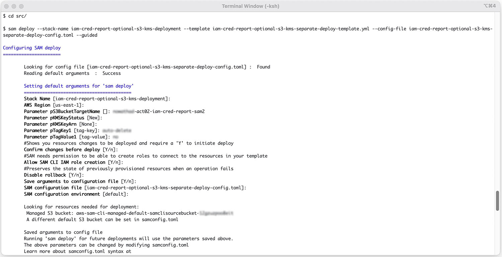
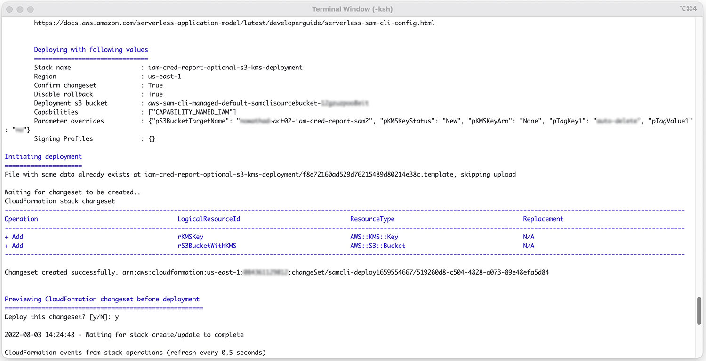
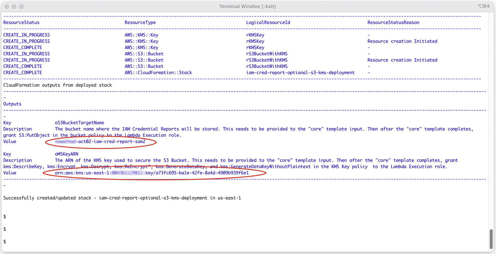

**Connected to management/payer account**
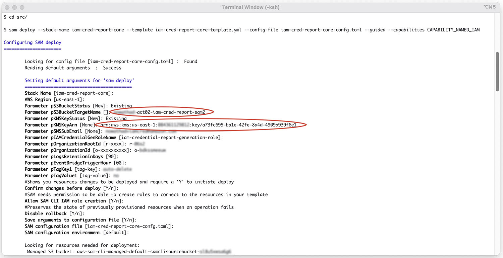
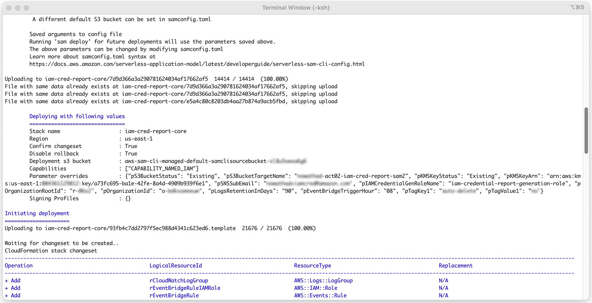
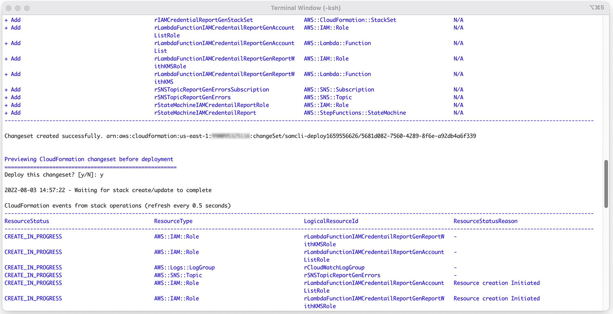
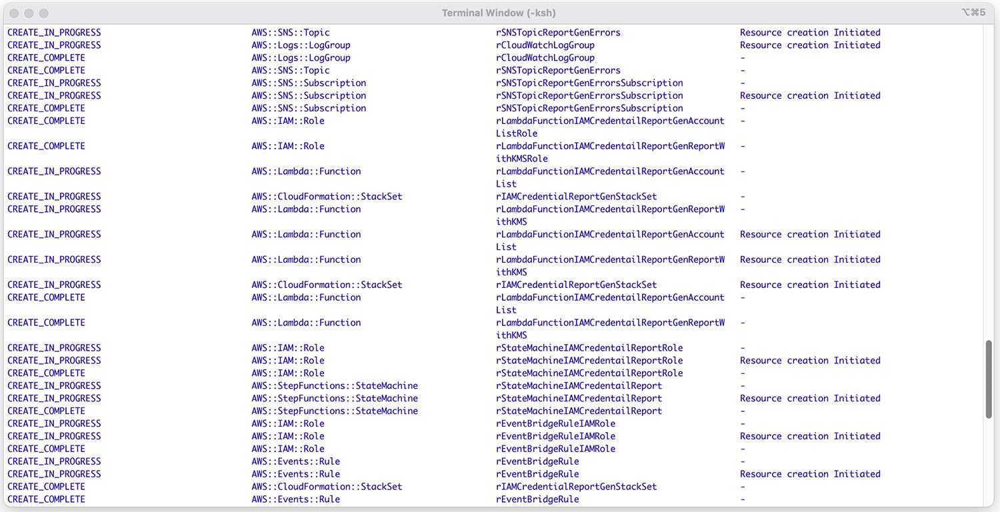
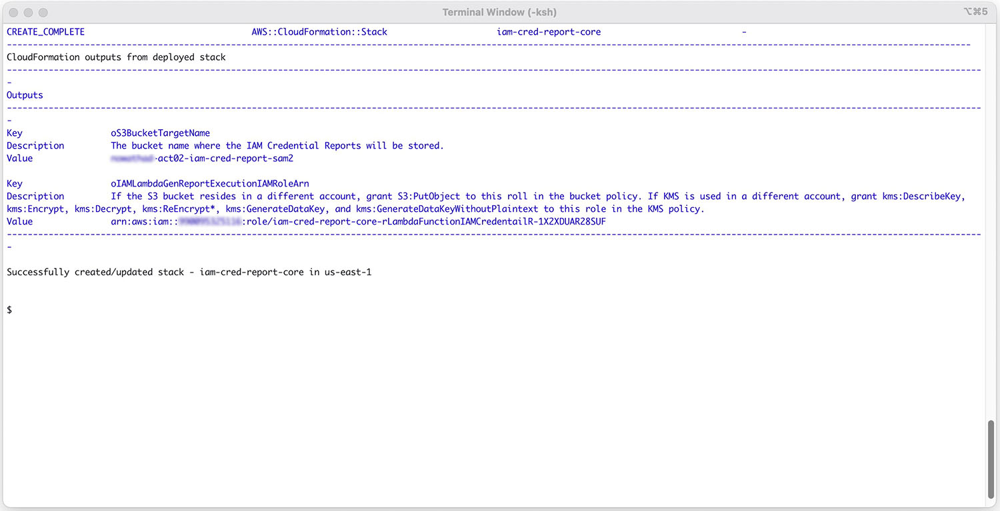

**Connected to security/logging account**
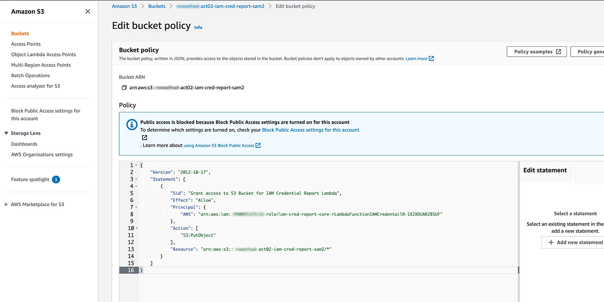
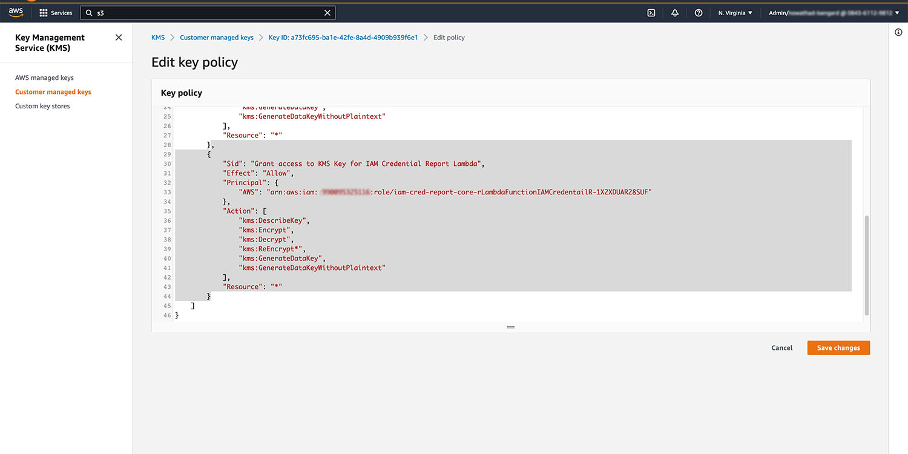

### Accept the SNS email confirmation
If you provided an email address, you will get an email that must be confirmed in order for the SNS subscription to send you notifications about non process fatal errors for a single account.

**In your email client, accept the subscription**
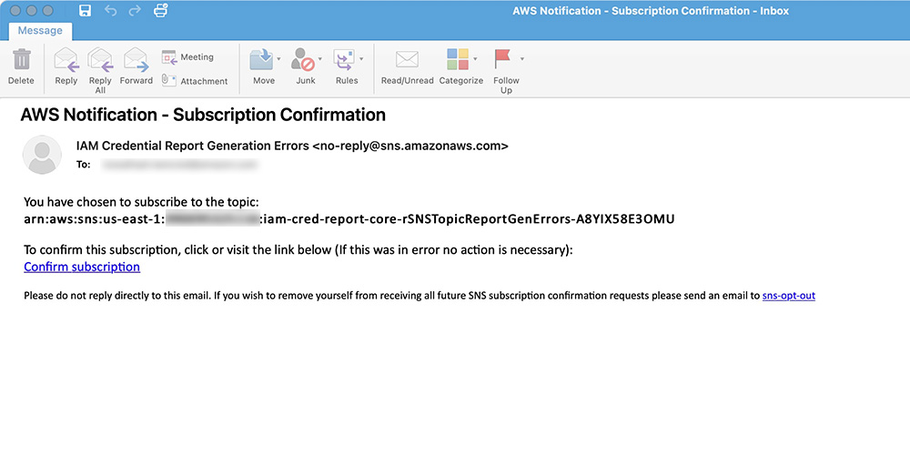

[Return to README.md](README.md#deployment-option-2-storing-reports-in-separate-loggingsecurity-account)