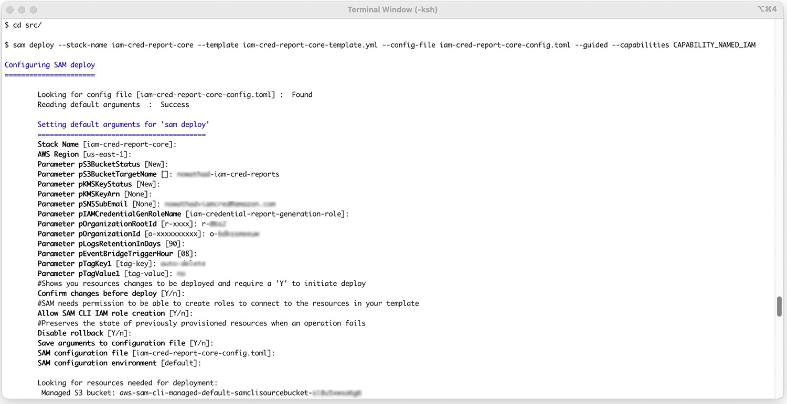
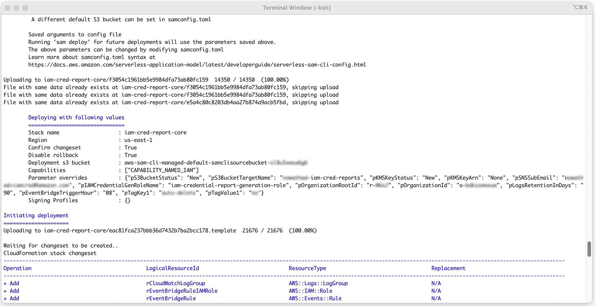
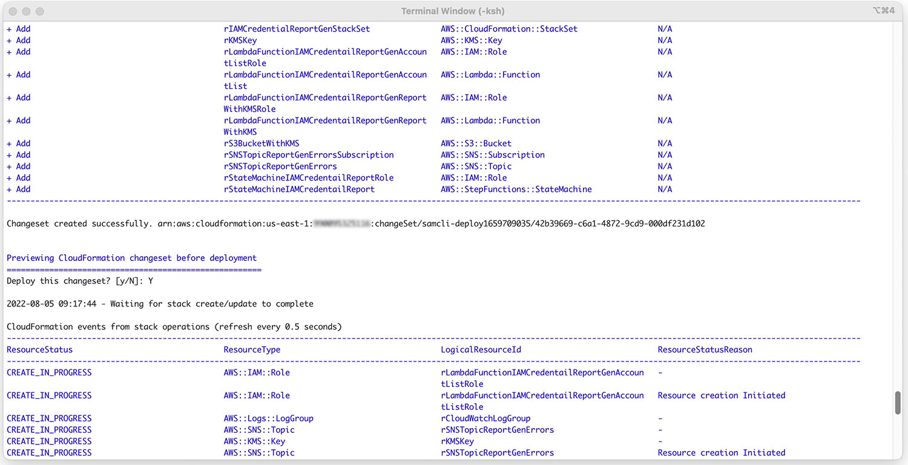
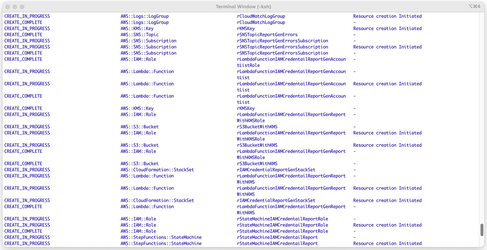
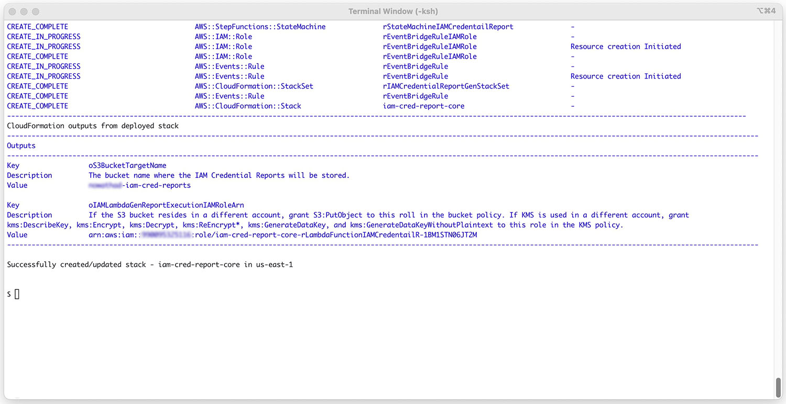

# Deploying the solution using the management account to store the reports
This deployment option will involve using only the "core" AWS SAM template and you only need to run a single command. The S3 bucket that will contain the IAM credential reports will exist in the management account.

## Step 1: Deploy solution using AWS SAM
Use the AWS SAM CLI to deploy the core template to create all resources necessary for the solution. Note, if desired, you can use an existing S3 bucket in the management account.

Navigate to the root of the solution and run the following command when connected to the management account:
```cd src/
sam deploy --stack-name iam-cred-report-core --template iam-cred-report-core-template.yml --config-file iam-cred-report-core-config.toml --guided --capabilities CAPABILITY_NAMED_IAM
```

The command above transforms the AWS SAM template into a CloudFormation stack template and then creates the stack. The configuration file referenced will provide initial values and also allows you to store your responses to the guided questions for later executions.
The following details will need to be provided:
  - Parameter `pS3BucketStatus [New]:` Chose New or Existing. If you use an Existing S3 bucket, the KMS key settings must match the S3 Bucket settings.
  - Parameter `pS3BucketTargetName []:` Provide the S3 bucket name.
  - Parameter `pKMSKeyStatus [None]:` Choose, New, Existing, or None for a new S3 bucket. Choose Existing or None for an existing S3 bucket. None will use SSE-S3 keys for the default encryption.
  - Parameter `pKMSKeyArn [None]:` None or the ARN of the KMS key.
  - Parameter `pSNSSubEmail []:` You can optionally provide an email address for the SNS topic to send account level errors.
  - Parameter `pIAMCredentialGenRoleName [iam-credential-report-generation-role]:` Provide a unique name for the role that the template creates in each member account.
  - Parameter `pOrganizationRootId []:` Provide the Organization Root ID (r-xxxx). You can find the value in the management account in the AWS Console.
  - Parameter `pOrganizationId []:` Provide the Organization ID in the form of (o-xxxxxxxxxxxx). You can find the value in the management account in the AWS Console.
  - Parameter `pLogsRetentionInDays [90]:` Provide the number of days to retain the Amazon CloudWatch log groups logs.
  - Parameter `pEventBridgeTriggerHour []:` Provide the two-digit hour (00-23) in UTC time used to trigger the EventBridge rule each day.
  - Parameter `pTagKey1 [tagkey]:` A Tag key to add to the resources.
  - Parameter `pTagValue1 [tagvalue]:` The value to associate with the Tag key.
The Outputs section of the AWS SAM CLI process will include the ARN of the Lambda function execution role as well as the S3 bucket name. For this deployment option, the Output is only for reference.


### CloudFormation outputs from deployed stack
```
--------------------------------------------------------------------
Outputs
--------------------------------------------------------------------
Key                 oS3BucketTargetName
Description         The bucket name where the IAM Credential Reports will be stored.
Value               xxxxxxxxxxxx-iam-cred-report

Key                 oIAMLambdaGenReportExecutionIAMRoleArn
Description         If the S3 bucket resides in a different account, grant S3:PutObject to this roll in the bucket policy. If KMS is used in a different account, grant kms:DescribeKey, kms:Encrypt, kms:Decrypt, kms:ReEncrypt*, kms:GenerateDataKey, and kms:GenerateDataKeyWithoutPlaintext to this role in the KMS policy.
Value               arn:aws:iam::xxxxxxxxxxxx:role/iam-cred-report-core-rLambdaFunctionIAMCredentailR-xxxxxxxxxxxxx
--------------------------------------------------------------------
```

### Sample output for single management/payer account deployment
**Connected to management account**






### Accept the SNS email confirmation
If you provided an email address, you will get an email that must be confirmed in order for the SNS subscription to send you notifications about non process fatal errors for a single account.

**In your email client, accept the subscription**


[Return to README.md](https://gitlab.aws.dev/nowathad/iam-credential-report-step-functions-automation/-/tree/main#deployment-option-1-storing-reports-in-management-account)