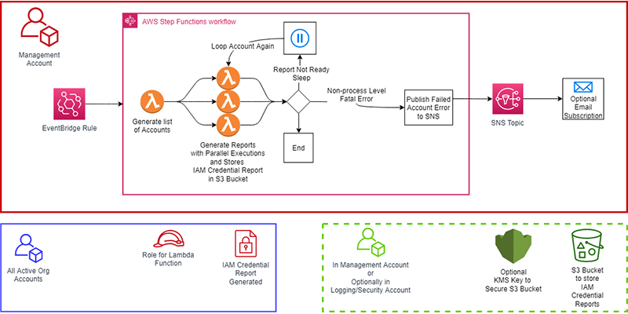
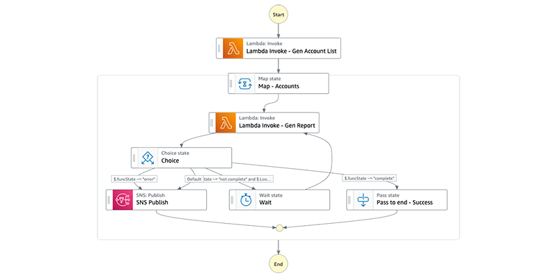
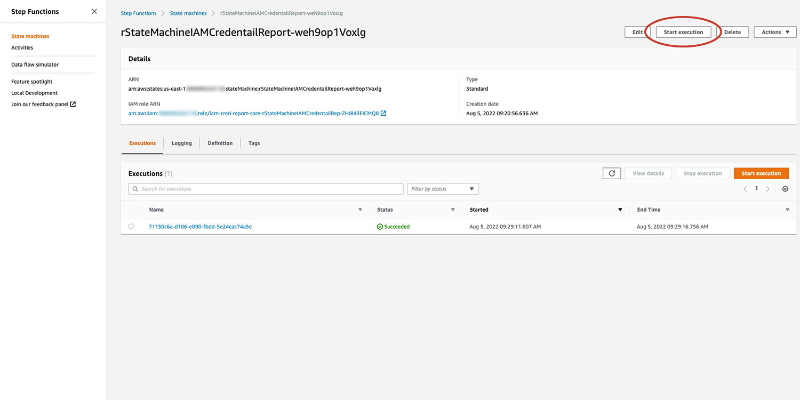
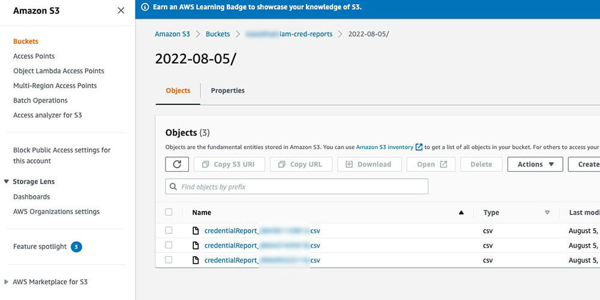

# Blog Post - Automating IAM credential reports for large AWS Organizations
This solution originated from blog post [Automate IAM credential reports at scale across AWS](https://aws.amazon.com/blogs/infrastructure-and-automation/automate-iam-credential-reports-at-scale-across-aws/) and will soon evolve into a blog post called "Automating IAM credential reports for large AWS Organizations".

Properly securing an AWS Organization includes managing AWS Identity and Access Management (IAM) credentials. Within each account of the organization, you may generate IAM credential reports. However, when an organization has many accounts, to get consistent and regular reports for every account, you need automation.
The primary benefits of using the AWS Step Functions in this solution includes both an increase in parallelism, by fanning out the report generation, as well as reducing AWS Lambda costs by moving wait time to outside the Lambda function. Execution time makes up one component of Lambda pricing, while Step Function pricing for standard workflows focuses on state transitions. The act of generating the IAM credential report involves an asynchronous call that can take time to complete. By exiting the Lambda function, and waiting inside the Step Function workflow, not only does that reduce the Lambda function execution time, but avoids the potential for exceeding the function’s maximum execution time for organizations with many accounts. By using a long enough sleep period in the workflow, the process can delay for a much longer time with only a few state transitions.
This post shows how to automate the generation of IAM credential reports across organizations and collect the output in a single Amazon Simple Storage Service (Amazon S3) bucket. The output can then be further processed or analyzed.

## Overview of solution
The solution uses an Amazon Event Bridge rule to trigger the Step Function State Machine. The State Machine will trigger a Lambda function to get all of the account IDs from the organization and then hand them over to a second Lambda function that will generate the IAM credential report. The process that creates the IAM credential report needs to assume a IAM role within each account. To facilitate the role creation, an AWS CloudFormation StackSet will deploy the role for the Lambda function into all the accounts linked to the management account.
The second Lambda function, which generates the reports, assumes the role, initiates the report generation, and then checks the status of the report for completion. Because of the asynchronous nature of the report generation, if the report is not ready, the Lambda function will exit and allow the State Machine to sleep for one minute. The State Machine will then invoke the second Lambda function again and continue to do so until either the IAM credential report finishes or the number of calls exceed the defined number of iterations. An iteration count exceeded error (default of 45 iteration) causes the Lambda function to exit with an error code that prompts the State Machine to send a message to an Amazon Simple Notification Service (Amazon SNS) topic with the account details. The optional email address, if provided during deployment, will receive the notification.
On successful report generation, the output file is copied to the defined S3 bucket and secured with the bucket's default encryption settings. The S3 bucket, and optional customer managed AWS Key Management Service (AWS KMS) key, can reside in the management account, or a separate security/logging account to provide isolation and separation of duties.

## Walkthrough
AWS Serverless Application Model (AWS SAM) is an open framework that provides syntax for deploying serverless applications. During the deployment, the AWS SAM CLI will package up the code and translate the YAML template into a CloudFormation template. AWS SAM will move the code and templates to S3 automatically for resource deployment.
This deployment has multiple options when it comes to the configuration of the solutions.
 1.	The first decision involves the location of S3 bucket. The reports can be sent to a separate logging/security account or contained in the management account. Separating the output from the organization's management account has advantages by separating the interests of different users as well as the ability to protect the data once generated. However, it does involve some additional steps to manage the cross-account security.
 2.	The second decision for the deployment allows for the use of an existing S3 bucket or to allow the process to create a new S3 bucket.
 3.	If the process creates a new S3 bucket, the third decision involves they type of default encryption for the bucket. The choice is between Amazon S3-Managed key (SSE-S3) or a customer managed AWS KMS key (SSE-KMS). In the case of the SSE-KMS key, the process can either create a new key or use an existing key. Note, if using an existing S3 bucket, provide the process the values based on the S3 buckets configuration. Be aware that additional security steps are needed for cross-account access.
 4.	The final decision focuses on notifications from the SNS topic. By providing an email address to the process, a subscription to the SNS topic is created. Without an email address for notification, another process will need to manage the SNS topic messages.
  
### Prerequisites
  - An [AWS account](https://signin.aws.amazon.com/signin?redirect_uri=https%3A%2F%2Fportal.aws.amazon.com%2Fbilling%2Fsignup%2Fresume&client_id=signup).
  - AWS Organization with multiple accounts.
  - The [AWS Serverless Application Model (AWS SAM) CLI](https://aws.amazon.com/serverless/sam/).

### Contents of the solution
The solution contains two AWS SAM templates and associated config files:
  - `src/iam-cred-report-optional-s3-kms-separate-deploy-template.yml` - This file contains the AWS SAM definitions for the optional deployment of the S3 Bucket and AWS KMS key to a separate logging/security account.
  -	`src/iam-cred-report-optional-s3-kms-separate-deploy-config.toml` - This contains some predefined values for the associated template.
  - `src/iam-cred-report-core-template.yml` - This file contains the AWS SAM definitions for the required resources in the management account as well as deploying a CloudFormation StackSet to create an IAM role to be assumed in all of the member accounts of the organization.
  - `src/iam-cred-report-core-config.toml` - This contains some predefined values for the associated template.
The solution contains two Lambda functions:
  - `src/lambda-handlers/iam-credential-report-gen-account-list.py` - This file contains the Python code for a Lambda function that retrieves a list of active accounts from the organization and returns the list to the caller.
  - `src/lambda-handlers/iam-credential-report-gen-report.py` - This file contains the Python code for a Lambda function that will assume the IAM role in each account in the organization and handle the generation and storage of the IAM credential report.
  
The solution contains one Step Function State Machine definition:
  - `src/statemachine/iam-credential-report-state-machine.json` - This file contains the JSON code that defines the Step Function State Machine that will manage the Lambda functions.

## Deployment option 1 - storing reports in management account
This deployment option will involve using only the "core" AWS SAM template and you only need to run a single command. The S3 bucket that will contain the IAM credential reports will exist in the management account.

[Instructions for this deployment](Deployment-instructions-management-account.md)

## Deployment option 2 - storing reports in separate logging/security account
This deployment option uses both of the AWS SAM templates to separate the resources between the logging/security account and the management account. The third step involves the manual grants required in the logging/security account for the Lambda function to access the S3 bucket and optional customer managed KMS key.

[Instructions for this deployment](Deployment-instructions-logging-account.md)

## Triggering the State Machine
The EventBridge rule triggers the State Machine at the hour specified in the deployment. However, you can trigger the State Machine manually from the [Console](https://us-east-1.console.aws.amazon.com/states/home?region=us-east-1#/statemachines) by selecting the State Machine details panel and choosing Start execution. No values are needed for the input JSON.

## Accessing the IAM Credential reports
The Lambda function stores the IAM Credential reports in the S3 bucket with a prefix that represents the date. Triggering the process multiple times in a single day will overwrite the prior contents. Each IAM Credential report includes the account number in the name.

## How to analyze IAM credential reports
The CSV reports created by this solution can be ingested by AWS services such as [Amazon Athena](https://aws.amazon.com/athena/?whats-new-cards.sort-by=item.additionalFields.postDateTime&whats-new-cards.sort-order=desc), [Amazon QuickSight](https://aws.amazon.com/quicksight/), or third-party products from our [AWS Partners](https://partners.amazonaws.com/search/partners?facets=Use%20Case%20%3A%20Data%20and%20Analytics%7CUse%20Case%20%3A%20Data%20and%20Analytics%20%3A%20BI%20and%20Visualization). This solution does not focus on the report analysis.

## Lambda Python code overview
The two lambda functions separate out the distinct steps of the process. Both functions use the [AWS SDK for Python (Boto3)](https://aws.amazon.com/sdk-for-python/) to interact with the AWS resources. For more information on Boto3, see the [documentation](https://boto3.amazonaws.com/v1/documentation/api/latest/index.html).

At a high level, the two Lambda functions will perform the steps described below:

### Lambda iam-credential-report-account-list function
This function will use the [organizations](https://boto3.amazonaws.com/v1/documentation/api/latest/reference/services/organizations.html) client [list_accounts](https://boto3.amazonaws.com/v1/documentation/api/latest/reference/services/organizations.html#Organizations.Client.list_accounts) API to return a list of account IDs and their details. For any account not SUSPENDED, the account ID is added to a Python list. This process will continue to loop through calls to list_accounts until all the accounts for an organization are returned. Then the list is passed back to the caller (the Step Function State Machine).

### Lambda iam-cred-report-gen-report function
This function receives an account ID from the Step Function State Machine and will use the [STS](https://boto3.amazonaws.com/v1/documentation/api/latest/reference/services/sts.html) client [assume_role](https://boto3.amazonaws.com/v1/documentation/api/latest/reference/services/sts.html#STS.Client.assume_role) API call to operate in the provided account ID. The function will then use the [IAM](https://boto3.amazonaws.com/v1/documentation/api/latest/reference/services/iam.html) client [generate_credential_report](https://boto3.amazonaws.com/v1/documentation/api/latest/reference/services/iam.html#IAM.Client.generate_credential_report) API call to trigger the credential report creation. The API call returns the state of the report (STARTED, INPROGRESS, or COMPLETE). If the report is not COMPLETE, the function will check the number of times it has issued the API call against the defined limit and either exit, setting an error state, or exit asking the State Machine to sleep and loop again. These status values are received by the State Machine and then passed back to the Lambda function with the account ID the next time it is called.

If the function finds the report is COMPETLE, the [get_credential_report](https://boto3.amazonaws.com/v1/documentation/api/latest/reference/services/iam.html#IAM.Client.get_credential_report) API is called to retrieve the data and store it in the Lambda function's temporary disk space. The Lambda function will then use [S3](https://boto3.amazonaws.com/v1/documentation/api/latest/reference/services/s3.html) object [put](https://boto3.amazonaws.com/v1/documentation/api/latest/reference/services/s3.html#S3.Object.put) API call to store the file in the defined S3 bucket before exiting with a status that indicates the work for the account ID is complete.

### Enhancements
This sample code offers an initial deployment option. Some suggestions for enhancing the solution include:
- Limiting the account list generation to Organizational Units (OUs) if different groups in the larger organization need separate output
- Building workflows off the SNS topic to automate error handling
- Using the output to trigger additional workflows (e.g. automated IAM User cleanup or other actions based on IAM User status)
- Modify the S3 object name to allow for multiple runs in a given day

## Cleaning up
To avoid incurring future changes, complete the following steps to delete the resources created by this process:
 1.	If you created a new S3 bucket, navigate to the [S3 Console](https://s3.console.aws.amazon.com/s3/buckets?region=us-east-1), select the bucket where the IAM credential reports are stored, and [empty the bucket](https://docs.aws.amazon.com/AmazonS3/latest/userguide/empty-bucket.html) to remove all the contents.
 2.	Navigate to the [CloudFormation Console](https://console.aws.amazon.com/cloudformation/), select the stack and [delete the stack](https://docs.aws.amazon.com/AWSCloudFormation/latest/UserGuide/cfn-console-delete-stack.html). If you used a separate security/logging account, delete the second stack as well.

## Conclusion
In this post, we demonstrated a method of consolidating IAM credential reports for an entire organization into an S3 bucket using Step Functions and Lambda. Having an organizational view of security data allows you to take a more wholistic approach to managing security and compliance needs. Automating the collection of that data reduces the effort and likelihood of errors and omissions.

## Security
See [CONTRIBUTING](CONTRIBUTING.md#security-issue-notifications) for more information.

## License
This library is licensed under the MIT-0 License. See the LICENSE file.
